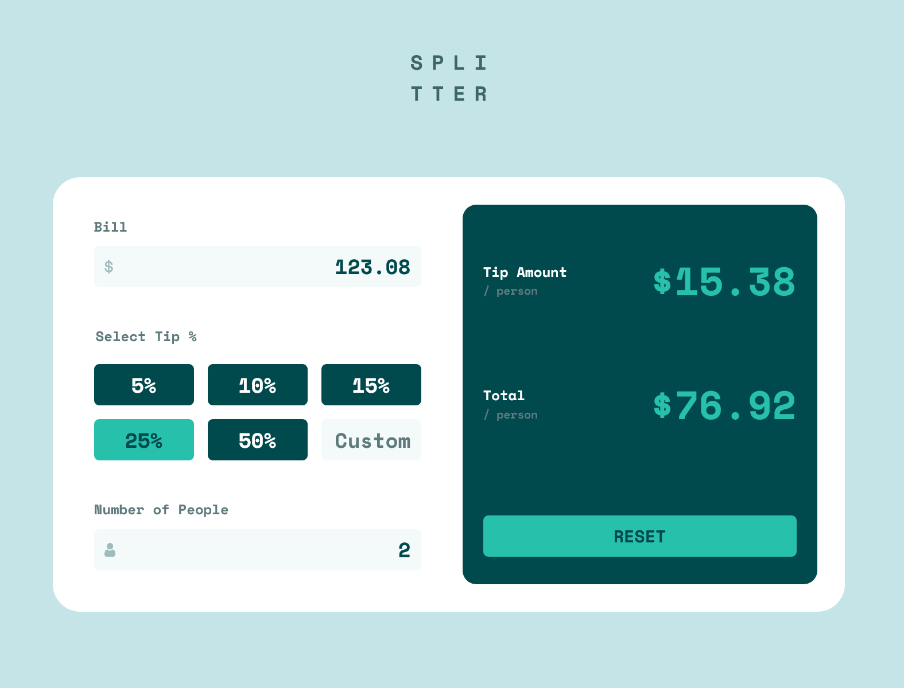
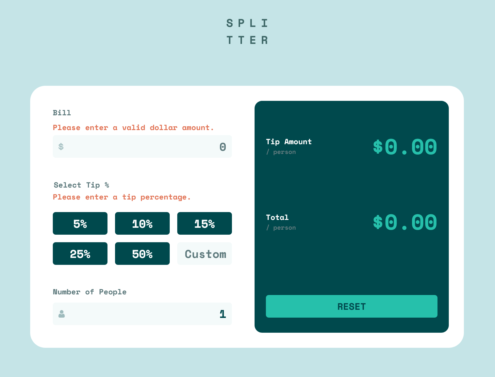

# Frontend Mentor - Tip calculator app solution

This is a solution to the [Tip calculator app challenge on Frontend Mentor](https://www.frontendmentor.io/challenges/tip-calculator-app-ugJNGbJUX). Frontend Mentor challenges help you improve your coding skills by building realistic projects.

## Table of contents

- [Overview](#overview)
  - [The challenge](#the-challenge)
  - [Screenshots](#screenshots)
  - [Links](#links)
- [My process](#my-process)
  - [Built with](#built-with)
  - [Project workflow](#project-workflow)
  - [Continued development](#continued-development)
  - [Useful resources](#useful-resources)
- [Author](#author)


## Overview

### The challenge

Users should be able to:

- View the optimal layout for the app depending on their device's screen size
- See hover states for all interactive elements on the page
- Calculate the correct tip and total cost of the bill per person
- See error states when required data is missing

### Screenshots





### Links

- [Frontend Mentor solution page](https://www.frontendmentor.io/solutions/responsive-tip-calculator-app-using-javascript-UbtSuCO0Vv)
- [live site](https://visionary-maamoul-a920d6.netlify.app/)

## My process

### Built with

- Semantic HTML5 markup
- CSS custom properties
- Flexbox
- CSS Grid
- Mobile-first workflow
- Vanilla JavaScript


### Project workflow

In general, I didn't spend a terrible amount of time trying to make a pixel-perfect match with this project. As a non-pro Figma user, I found this design file a little more frustrating than usual. Instead, I eyeballed much of the final design and sought to achieve something that looked decent enough on various screens.

I'm still somewhat baffled by how to achieve a truly accessible form with radio inputs styled this way. I'm hoping it's not too woefully inadequate in that department but if anyone has any particular skills and experience here I'd welcome the feedback.

I know this is probably a little outdated, but these styles seemed the most straightforward way to eliminate the spin buttons (arrows) from the number inputs:

```css
input::-webkit-outer-spin-button,
input::-webkit-inner-spin-button {
  -webkit-appearance: none;
  margin: 0;
}

/* Firefox */
input[type=number] {
  appearance: textfield;
}
```

I went through several iterations of handling the data validation and eventually landed on using an object to hold the logic. This felt the most scalable and cleanest to me but I'm sure there's a more elegant way to accomplish it as well:

```js
const validations = {
  billAmount: {
    validate: (value) => !isNaN(value) && value > 0,
    elementId: "billError",
    errorMessage: "Please enter a valid dollar amount."
  },
  numPeople: {
    validate: (value) => !isNaN(value) && value > 0,
    elementId: "peopleError",
    errorMessage: "Please enter at least 1 person."
  },
}

function validateField(field, value) {
  const rule = validations[field];
  if (!rule.validate(value)) {
    renderError(rule.elementId, rule.errorMessage);
    return false;
  }
  renderError(rule.elementId, '');
  return true;
}
```

### Continued development

The error elements (p elements) are currently part of the initial DOM and empty by default. Empty elements like this are generally a bad practice. A future enhancement of this project would include dynamically creating/removing the error elements as needed.

### Useful resources

- [Remove arrows from number inputs](https://www.geeksforgeeks.org/how-to-disable-arrows-from-number-input/) - Where I found the CSS to remove the spin buttons.

- [Example resource 2](https://www.example.com) - This is an amazing article which helped me finally understand XYZ. I'd recommend it to anyone still learning this concept.


## Author

- Website - [Matt Pahuta](https://www.mattpahuta.com)
- Frontend Mentor - [@mattpahuta](https://www.frontendmentor.io/profile/MattPahuta)
- Twitter - [@mattpahuta](https://www.twitter.com/MattPahuta)
- LinkedIn - [Matt Pahuta](www.linkedin.com/in/mattpahuta)
